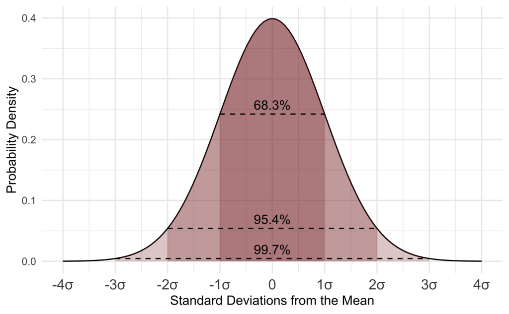

# **Introduction to the Normal Distribution**  

---

## **1. What is the Normal Distribution?**  

The **Normal Distribution** (also called the **Gaussian Distribution**) is one of the most important probability distributions in statistics. It is a continuous distribution that describes many natural and social phenomena, such as:  
- Heights of people  
- Exam scores  
- IQ scores  
- Measurement errors  
- Stock market returns  

A normal distribution has a **bell-shaped curve**, meaning most values are **clustered around the mean** and fewer values occur as we move away from it.

---

## **2. Why is the Normal Distribution Important?**  

1. **Many real-world phenomena follow a normal distribution.**  
   - Example: The height of adult males in a country is approximately normally distributed, meaning most men have average height, while very short and very tall men are rare.  
   
2. **It allows us to make predictions.**  
   - Example: If we know students' exam scores follow a normal distribution, we can estimate how many students scored above or below a certain grade.  
   
3. **It is widely used in statistics and machine learning.**  
   - Many statistical tests assume data is normally distributed.  
   - AI models often use the normal distribution to predict trends.  

---

## **3. Characteristics of the Normal Distribution**  

A normal distribution is defined by **two parameters**:  
1. **Mean $\mu$** – The center of the distribution (average value).  
2. **Standard deviation $\sigma$** – Measures the spread of the data.  

The **probability density function (PDF)** of a normal distribution is:

$$
f(x) = \frac{1}{\sigma \sqrt{2\pi}} e^{-\frac{(x - \mu)^2}{2\sigma^2}}
$$

where:
- $e$ is Euler’s number $\approx 2.718$.
- $\pi$ is the mathematical constant $\approx 3.1416$.

The shape of the normal distribution depends on $\mu$ and $\sigma$:
- **A larger $\sigma$** means a wider, more spread-out curve.
- **A smaller $\sigma$** means a taller, narrower curve.

---

## **4. The Empirical Rule (68-95-99.7 Rule)**  

The **Empirical Rule** states that for a normal distribution:  
- **68%** of values fall within **one standard deviation** $\mu \pm \sigma$.  
- **95%** of values fall within **two standard deviations** $\mu \pm 2\sigma$.  
- **99.7%** of values fall within **three standard deviations** $\mu \pm 3\sigma$.  

**Example:** IQ scores follow a normal distribution with:
- Mean: $\mu = 100$
- Standard deviation: $\sigma = 15$

Applying the **68-95-99.7 Rule**:
- **68%** of people have IQs between $85$ and $115$.
- **95%** have IQs between  $70$ and $130$.
- **99.7%** have IQs between $55$ and $145$.

This helps psychologists and educators understand IQ levels in a population.

**Example:** Heights of People

Let’s assume the height of adult men follows a **normal distribution** with:
- Mean $\mu = 175$ cm
- Standard deviation $\sigma = 10$ cm

This means:  
- **68%** of men have heights between $175 - 10$ cm and $175 + 10$ cm (**165 cm to 185 cm**).  
- **95%** of men have heights between $175 - 210$ cm and $175 + 210$ cm (**155 cm to 195 cm**).  
- **99.7%** of men have heights between $175 - 310$ cm and $175 + 310$ cm (**145 cm to 205 cm**).  

🔹 **Interpretation:** Almost **all** men are between **145 cm and 205 cm** tall, with most around **175 cm**.  

---

## **5. Real-Life Applications of the Normal Distribution**  

1. **Grading Exams:**  
   - Professors curve test scores based on normal distribution.  

2. **Stock Market Analysis:**  
   - Financial analysts assume stock returns follow a normal distribution.  

3. **Medical Testing:**  
   - Blood pressure, cholesterol levels, and body temperature are normally distributed in healthy populations.  

4. **Quality Control in Manufacturing:**  
   - Product weights and sizes follow normal distributions, ensuring consistency.  

---
# **Probability in the Normal Distribution**

## **1. Understanding Probability in the Normal Distribution**
The **Normal Distribution** describes how values of a random variable are spread around the mean. Since it is a **continuous distribution**, we cannot calculate the probability of a **single value**. Instead, we calculate the probability of a **range of values**.

The probability that a normally distributed variable $ X $ falls within an interval  $[a, b]$ is:

$$
P(a \leq X \leq b) = \int_{a}^{b} f(x) dx
$$

where $f(x)$ is the **Probability Density Function (PDF)**:

$$
f(x) = \frac{1}{\sigma \sqrt{2\pi}} e^{-\frac{(x - \mu)^2}{2\sigma^2}}
$$

Since integration is difficult to solve manually, we use **Z-scores and normal probability tables (Z-tables)**.

---

## **2. Converting to the Standard Normal Distribution**
Instead of integrating the PDF, we convert values to the **Standard Normal Distribution** (mean $\mu = 0$, standard deviation $\sigma = 1$) using the **Z-score formula**:

$$
Z = \frac{X - \mu}{\sigma}
$$

:star: *The **Z-score** tells us how many standard deviations a value is from the mean. It allows us to use standard normal tables to find probabilities.*
---
## 3. Examples of Probability in Normal Distribution

### **Probability of a Student’s Test Score**
#### **Problem Statement:**
A class’s test scores are normally distributed with:
- **Mean** $\mu = 70$
- **Standard deviation** $\sigma = 10$

Find the probability that a randomly selected student scores **less than 80**.

#### **Step 1: Convert $X = 80$ to a Z-score**
$$
Z = \frac{80 - 70}{10} = \frac{10}{10} = 1
$$

#### **Step 2: Use the Z-table**
From the Z-table:

$$
P(Z \leq 1) = 0.8413
$$

This means there is an **84.13% chance** that a student scores **below 80**.

---

### **Probability of a Range of IQ Scores**
#### **Problem Statement:**
IQ scores follow a normal distribution with:
- **Mean** $\mu = 100$
- **Standard deviation** $\sigma = 15$

Find the probability that a randomly chosen person has an IQ **between 85 and 115**.

#### **Step 1: Convert Values to Z-scores**
For $X = 85$:

$$
Z = \frac{85 - 100}{15} = \frac{-15}{15} = -1
$$

For $X = 115$:

$$
Z = \frac{115 - 100}{15} = \frac{15}{15} = 1
$$

#### **Step 2: Find the Probabilities**
From the Z-table:

$$
P(Z \leq 1) = 0.8413
$$

$$
P(Z \leq -1) = 0.1587
$$

#### **Step 3: Find $P(85 \leq X \leq 115)$**

$$
P(85 \leq X \leq 115) = P(Z \leq 1) - P(Z \leq -1)
$$

$$
= 0.8413 - 0.1587 = 0.6826
$$

**Interpretation:** About **68.26% of people** have an **IQ between 85 and 115**, which follows the **Empirical Rule** (68-95-99.7 Rule).

---

### **Probability of a Defective Product**
#### **Problem Statement:**
A factory produces metal rods with:
- **Mean length** $\mu = 50$ mm
- **Standard deviation** $\sigma = 2$ mm

A rod is **defective if it is shorter than 47 mm**. Find the probability of a rod being defective.

#### **Step 1: Convert $X = 47$ to a Z-score**
$$
Z = \frac{47 - 50}{2} = \frac{-3}{2} = -1.5
$$

#### **Step 2: Find $P(X \leq 47)$**
From the Z-table:

$$
P(Z \leq -1.5) = 0.0668
$$

**Interpretation:** About **6.68% of rods** are defective.

---
## **4. Key Takeaways**
- **Normal distributions are used to calculate probabilities** in real life.
- **We use Z-scores** to standardize values and compare them.
- **Z-tables help us find probabilities quickly** instead of integrating the PDF.
- **The Empirical Rule (68-95-99.7%)** helps estimate probabilities **without calculations**.

---
# LAB

**Exercise 1:** Quality Control in Manufacturing (Outlier Detection)
A factory produces steel rods, and their lengths follow a normal distribution ($\mu = 50mm,\ \sigma = 2mm$)

A rod is considered defective if its length is less than 46 mm or greater than 54 mm.

- Use [scipy_stats](https://docs.scipy.org/doc/scipy/reference/stats.html), compute the probability of a rod to be defective
- Compute the probability of a rod having its length between $49mm$ and $52mm$

**Exercise 2:** Stock Market Return Simulation
A stock has daily returns that follow a normal distribution:
- Mean daily return $\mu = 0.001\ (0.1\%)$
- Volatility (standard deviation) $\sigma = 0.02\ (2\%)$

1. Simulate 252 days (1 trading year) of stock returns.
2. Compute the final stock price if it starts at \$100.
3. Repeat the process 10,000 times to model different possible outcomes.
4. Compute the probability of the stock price dropping below \$90.